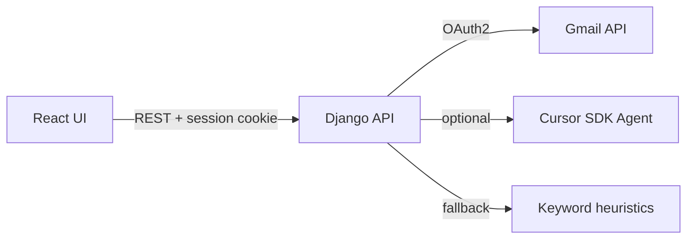

# Job Email Agent (Django + React)

A full-stack app that connects to **Gmail**, reads your inbox, and runs an **email agent** to flag messages that are important for your job. The React dashboard triggers checks and shows summaries; Django handles OAuth, Gmail API access, and agent logic.

## Architecture



- **Gmail**: OAuth2 read-only access to list and read inbox messages.
- **Agent**: If `CURSOR_API_KEY` is set, uses the [Cursor SDK](https://cursor.com/docs/sdk/python) to classify importance. Otherwise uses configurable keywords, company name, and sender domains.

**New here?** Start with **[SETUP_GUIDE.md](./SETUP_GUIDE.md)** — step-by-step checklists for Google OAuth, `.env`, running both servers, and first use.

| Goal | Guide |
|------|--------|
| Save code on GitHub (manual, safe) | **[GITHUB.md](./GITHUB.md)** |
| Deploy free on the internet | **[DEPLOYMENT.md](./DEPLOYMENT.md)** |

## Prerequisites

1. **Python 3.11+** and **Node.js 18+**
2. **Google Cloud project** with Gmail API enabled and an OAuth 2.0 **Web** client:
   - [Google Cloud Console](https://console.cloud.google.com/) → APIs & Services → Enable **Gmail API**
   - Credentials → Create OAuth client ID (Web application)
   - Authorized redirect URI: `http://localhost:5173/api/auth/gmail/callback/`
3. **(Optional)** [Cursor API key](https://cursor.com/dashboard/integrations) for smarter triage

## Setup

### Backend

```bash
cd backend
python -m venv .venv
# Windows
.venv\Scripts\activate
pip install -r requirements.txt
copy .env.example .env
# Edit .env: GOOGLE_CLIENT_ID, GOOGLE_CLIENT_SECRET, JOB_* fields
python manage.py migrate
python manage.py runserver
```

### Frontend

```bash
cd frontend
npm install
npm run dev
```

Open **http://localhost:5173**, click **Connect Gmail**, approve access, then **Check important emails**.

## Environment variables

See `backend/.env.example`. Important fields:

| Variable | Purpose |
|----------|---------|
| `GOOGLE_CLIENT_ID` / `GOOGLE_CLIENT_SECRET` | Gmail OAuth |
| `JOB_TITLE`, `JOB_COMPANY`, `JOB_SENDER_DOMAINS` | Context for the agent |
| `JOB_KEYWORDS` | Comma-separated signals (interview, deadline, …) |
| `CURSOR_API_KEY` | Enables Cursor SDK agent instead of heuristics only |

## API endpoints

| Method | Path | Description |
|--------|------|-------------|
| GET | `/api/health/` | Service status |
| GET | `/api/auth/gmail/start/` | Returns Google OAuth URL |
| GET | `/api/auth/gmail/callback/` | OAuth callback (browser redirect) |
| GET | `/api/auth/gmail/status/` | Connection state |
| POST | `/api/agent/check/` | Fetch inbox + run agent |
| GET | `/api/agent/latest/` | Last check result |

## Security notes

- Tokens are stored in the **Django session** (dev-friendly). For production, use encrypted storage and HTTPS.
- Gmail scope is **readonly**.
- Never commit `.env` or OAuth secrets.

## Troubleshooting

- **“Set GOOGLE_CLIENT_ID…”** — Fill in Google OAuth credentials in `backend/.env`.
- **Redirect URI mismatch** — Redirect URI in Google Console must match `GOOGLE_REDIRECT_URI` exactly.
- **CSRF errors on POST** — Frontend calls `ensureCsrf()` and sends `X-CSRFToken`; keep `credentials: "include"` and same-site cookies.
- **Cursor agent errors** — App falls back to heuristics; verify `CURSOR_API_KEY` or leave unset.
